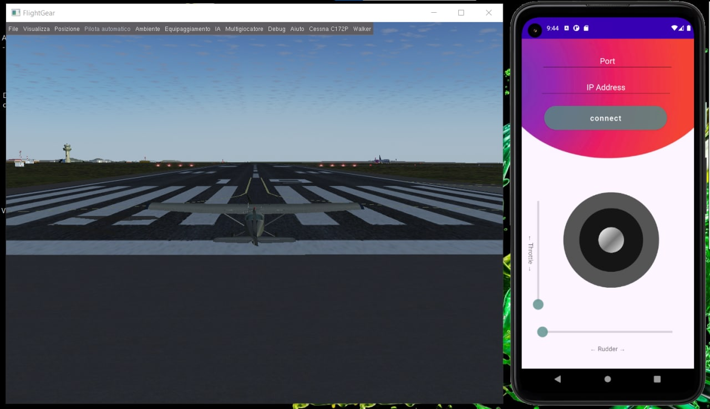

# Remote Joystick FlightGear - Android Application

[Click here for the Demo Video](https://www.youtube.com/watch?v=Dxv4OBAXZv4)


This project is a remote control for the famous flight simulator [FlightGear](https://www.flightgear.org/).  After inserting the correct IP Address and Port on the app, and clicking on the "connect" button, you will be able to control the ongoing flight specifics from the Joystick and SeekBars.


The remote control is built as an Androind Application, with backend written in `Java` and fronted as `xml` files. The app is developed using MVVM architecture.

## Getting Started

### Prerequisites

The Android Studio version used was 4.2.1, and the emulator was tested on a Pixel 4a API 30, Android 11.0.  
The FlightGear version used is 2020.3.6.  
The FlightGear is available for every OS, but note that the app sends new lines as `\r\n`, so that might be a problem if the computer running the FG isn't Windows.

Before starting the app, make sure to input the connection prompt on the flight gear preferences as: 

```
--telnet=socket,in,10,localhost,5400,tcp
```

Of course you can edit the IP Address and Port as you prefer.

You can now check the IP of the computer running the FG by typing `ipconfig` on the cmd for Windows, and Termial for Mac/Linux.

## Compiling & Running

Download this folder from Github and simply run it on Android Studio for a preview. 

Start the FlighGear on flight mode together with the app.
On the main and only activity insert the correct **IP Address** and **Port**, click on "connect" button, and start playing with the Joystick!    
  
The flight functionalites controlled are as follows:

**Throttle**: Vertical SeekBar  
**Rudder**: Horizontal SeekBar  
**Elevator**:  Vertical Joystick  
**Aileron**: Horizontal Joystick  

Here is a picture of the application & FlightGear operating together:

<kbd>
  
</kbd>

## Deployment

### Technologies Used:
Main technologies:
- `Android Studio`
- `Java`
- `TCP Connection`

### MVVM Architechture & Folders

Inside `Remote-Joystick/app/src/main/java/com/example/joystickandroidapp`, you will find the backend code, divide into MVVM architecture as follows:

**Model**: here lay the connection with the FG and all the logic-behind.  
**ViewModel**: here lay the data binding and all the intermediate relationships between View and Model.
**View**: here lay the MainActivity class and the Joystick componenet.

In addition, inside `Remote-Joystick/app/src/main/res/`, you will find all the `xml` files that render the app.

I provide a UML diagram for the backend under `uml.png`.

## Authors
- [Sara Spagnoletto](https://github.com/saraspagno)
